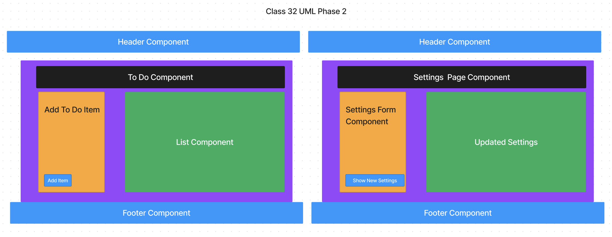
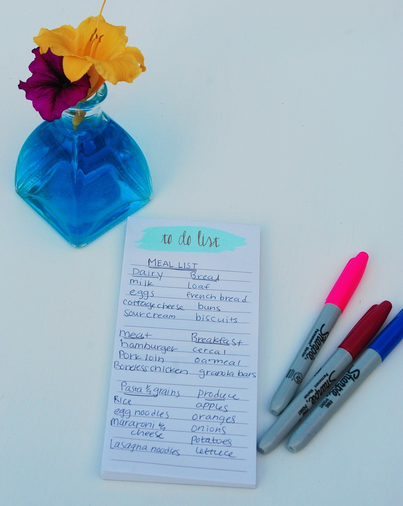

# To Do App

## Author: Eva Grace Smith

### todo-app

Our application will be an API testing tool that can be run in any browser, allowing a user to easily interact with APIs in a familiar interface.

## Phase 1: Application Setup

In Phase 1, we’re going to perform some refactoring of a Todo application built by another team. This application mixes application state and user settings at the top level and passes things around. It was a good proof of concept, but we need to make this production ready.

* Create a Detailed UML.

;

* Properly modularize the application into separate components, note the proposed file structure below.

* Implement the Context API to make some basic application settings available to components.

* Show three items by default.
* Hide completed items by default.
* Add the sort word ‘difficulty’ by default.

* Style the application using the Mantine Component API{target:_blank}.

* NOTE: The expectation to style this entire component in one day is likely unrealistic. The recommendation is to implement the required functionality, then systematically begin styling with Mantine. Match the comp image(s) as closely as possible. 80% of the design work will likely take 20% of your time. By the end of the week, being mostly there with style is the goal!

### Documentation:

* Describe how global state is consumed by the components.

Global state is consumed by the components through the use of the Context API. The components access the global state by wrapping themselves with a Context Provider, which makes the state available to them via the useContext hook. Components can then access and update the global state as needed.

* Describe the operation of the hook: useForm().

The useForm() hook is responsible for handling form state and providing methods and values to manage form inputs. It returns an object with properties such as form values, event handlers, and form submission functions. By using this hook, components can easily manage form state and interact with user input in a declarative and efficient manner.

### Utilization of AI:

* Prompt to write tests:

Could you help me write tests for this application? Here are some guidelines to use. Please utilize jest. 

Tests should assert all behavioral functionality.
Do a deep mount of the app, and set tests to make assertions on the child components that consume context from the Provider.
Can they see context?

### Links

[Deployment: CodeSandbox on context-settings branch](https://codesandbox.io/p/github/EvaGraceSmith/todo-app/context-settings?workspaceId=0f6b3b9a-f258-4570-996a-1c11d92f10b3)

## Phase 2 Requirements

In Phase 2, we’re going to extend the functionality of our application by allowing the user to make some decisions on how they would like the application to function. Specifically, we’ll let them make changes to 2 settings.

;

* Implement the Context API to make some basic application settings available to components.

* How many To Do Items to show at once.
* Whether or not to show completed items.
* Hint: if reusing the custom useForm() hook, event validation may be necessary if using any Mantine component other than <TextInput />.

* Provide the users with a form where they can change the values for those settings.
* This should be given in the form of a new component, perhaps linked to from the main navigation.
* Hint: Use Browser Router to create the page/route/component for this.
* Once settings are updated, render the updated settings to the right of the “form”. Consider using <Grid />, <Card />, and <When /> components.

* Save the users choices in Local Storage.
* Retrieve their preferences from Local Storage and apply them to the application on startup.

### Links

[Deployment: CodeSandbox on context-settings branch](https://codesandbox.io/p/github/EvaGraceSmith/todo-app/context-methods?workspaceId=0f6b3b9a-f258-4570-996a-1c11d92f10b3)

## To Do List Manager Phase 3: Adding security and access controls to the application.

In Phase 3, we’d like to extend the functionality of the application by requiring users be logged in to view items and also restrict access based on user type. The user stories from Phases 1, and 2 remain unchanged. For this phase, we are now adding the following new user stories.

* As a user, I want to provide a way for other users to create new accounts.
* As a user, I want to provide a way for all users to login to their account.
* As a user, I want to make sure that my To Do items are only viewable to users that have logged in with a valid account.
* As a user, I want to ensure that only fellow users that are allowed to “create”, based on their user type, can add new To Do Items.
* As a user, I want to ensure that only fellow users that are allowed to “update”, based on their user type, can mark To Do Items complete.
* As a user, I want to ensure that only fellow users that are allowed to “delete”, based on their user type, can delete new To Do Items.

### Credits

Image by <a href="https://pixabay.com/users/joyinthecommonplace-2801733/?utm_source=link-attribution&utm_medium=referral&utm_campaign=image&utm_content=1474675">Sarina Kinnunen</a> from <a href="https://pixabay.com//?utm_source=link-attribution&utm_medium=referral&utm_campaign=image&utm_content=1474675">Pixabay</a>

### Collaborators

Ryan Galloway - Instructor
Daniel Frey - TA
Mark Smith - Tutor

